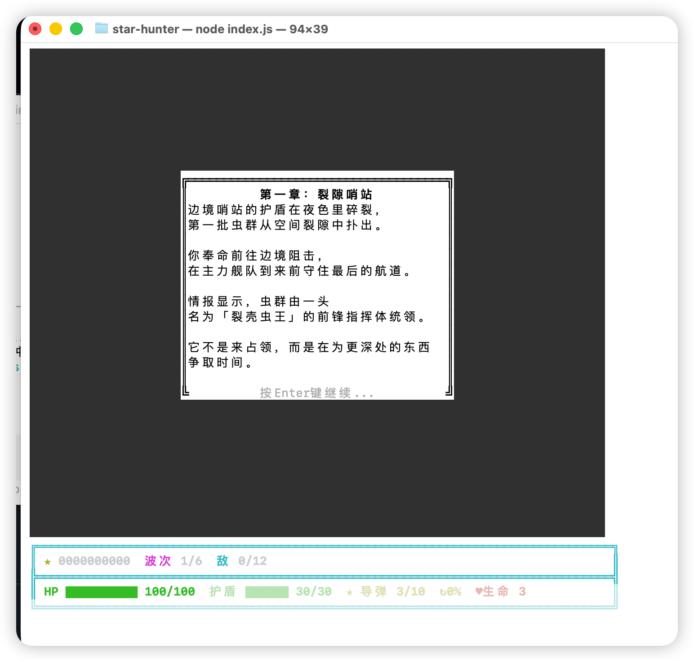
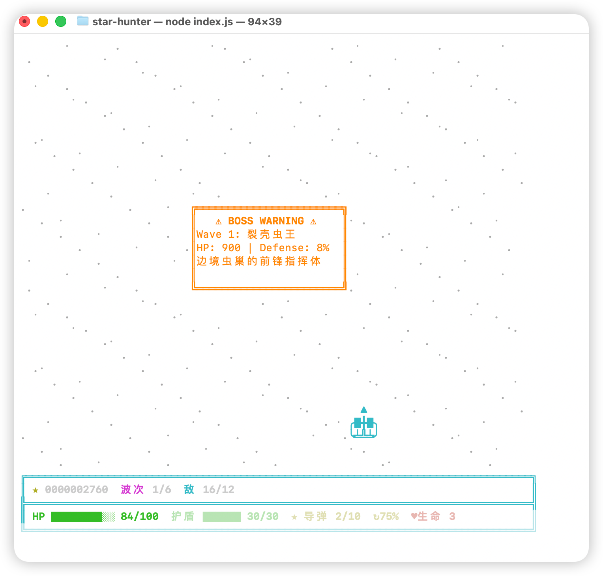
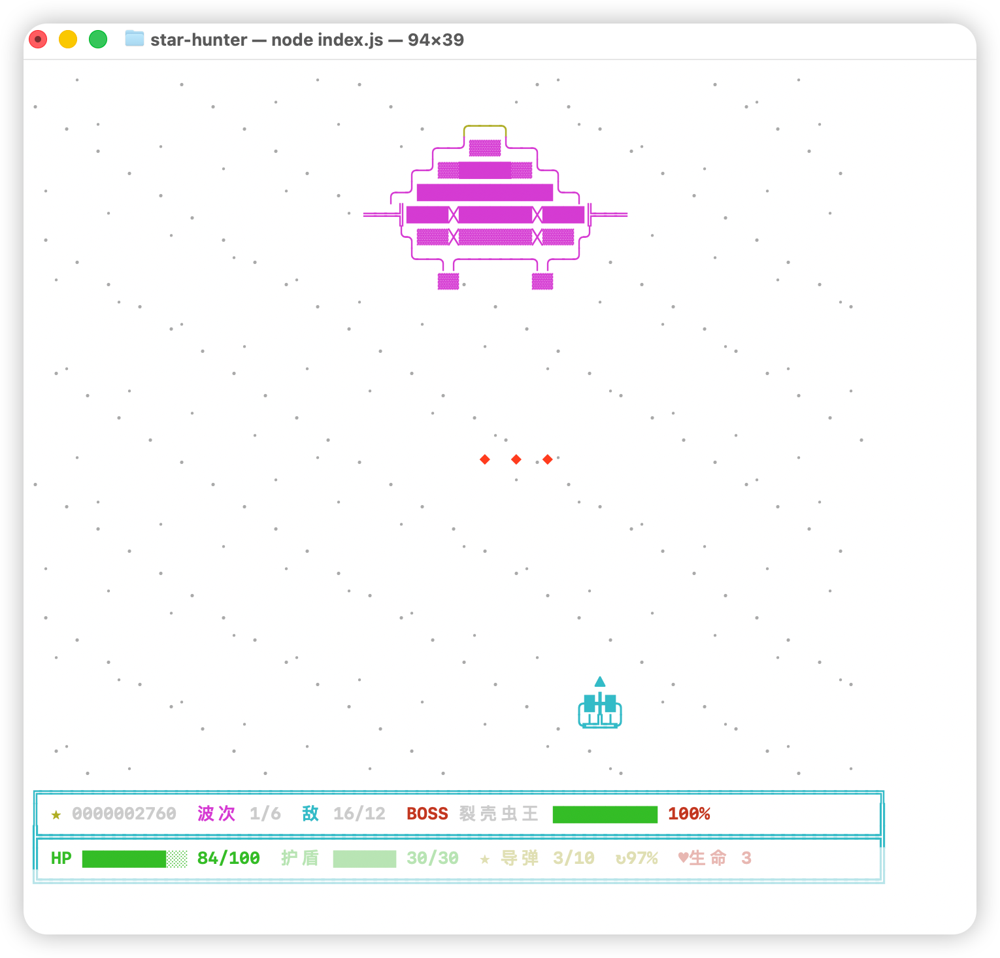
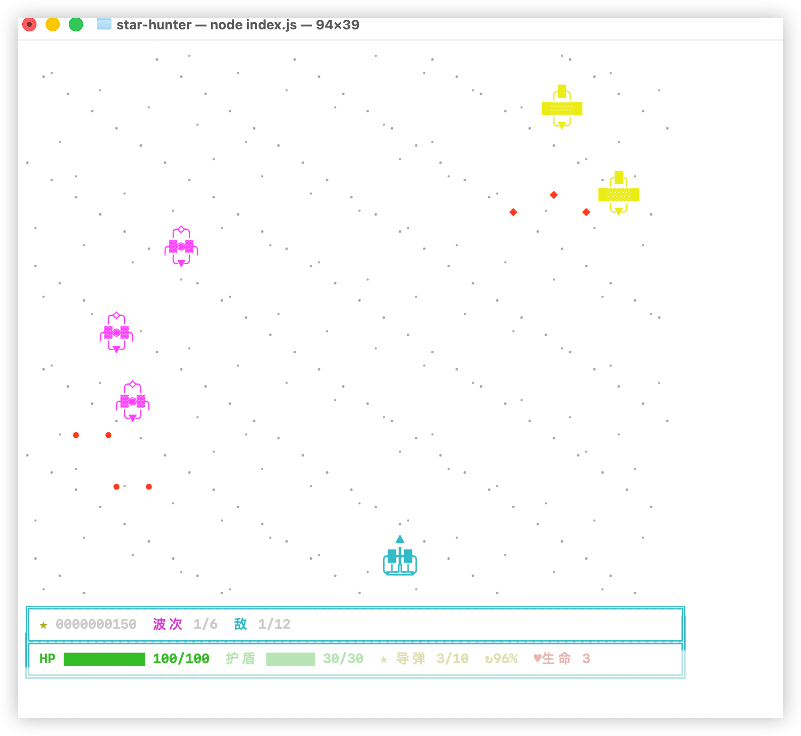
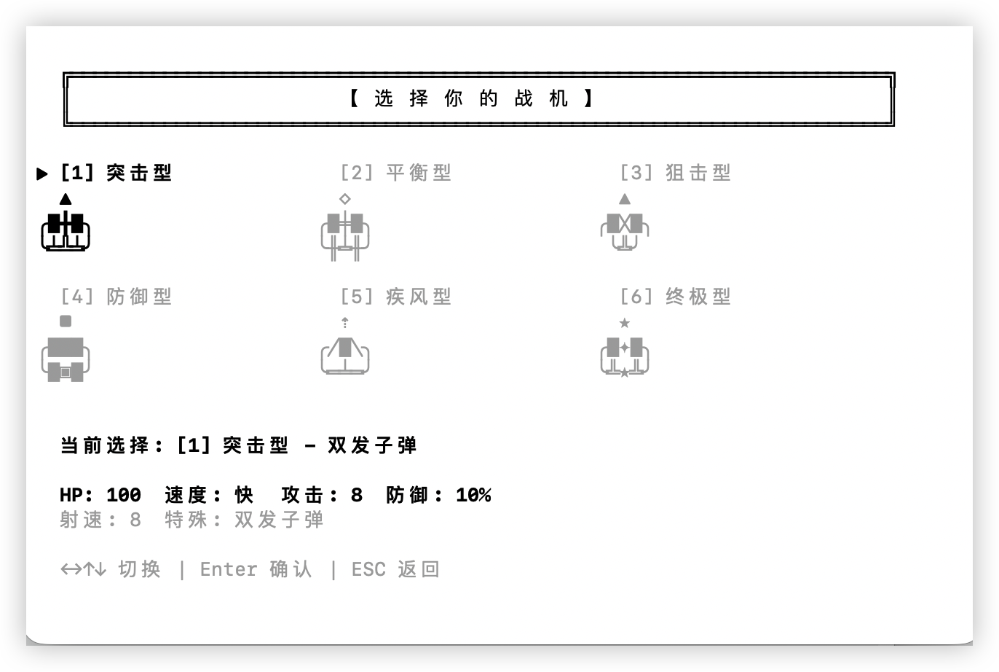

# 星际猎手 (Star Hunter)

基于 tico 引擎开发的终端弹幕射击游戏。

## 游戏截图











## 游戏特色

### 6种可玩战机
从6架独特战机中选择，每架都有不同的属性和玩法：

| 战机 | 类型 | 生命值 | 速度 | 攻击 | 防御 | 特殊能力 |
|------|------|--------|------|------|------|----------|
| 1 | 突击型 | 100 | 中 | 25 | 0% | 双发子弹 |
| 2 | 平衡型 | 150 | 中 | 20 | 10% | 三发子弹 |
| 3 | 狙击型 | 80 | 中 | 35 | 0% | 穿透子弹 |
| 4 | 防御型 | 200 | 慢 | 15 | 30% | 自动回血 |
| 5 | 疾风型 | 120 | 快 | 18 | 0% | 极速移动 |
| 6 | 终极型 | 180 | 快 | 30 | 20% | 全能型 |

### 道具系统
- **★ 导弹** - 战机专属特殊武器
- **⊙ 护盾** - 抵挡 incoming 伤害
- **✦ 无敌** - 3秒闪烁无敌状态
- **» 追踪导弹** - 自动锁定敌机
- **♥ 生命** - 恢复生命值

### 操作说明
| 按键 | 功能 |
|------|------|
| ↑↓←→ 或 WASD | 移动 |
| 空格 | 射击 |
| Q | 发射导弹 |
| E | 开关护盾 |
| P | 暂停 |

### 游戏玩法
- 击败6波敌人
- 每波最后都有强大的 Boss 战
- 击败全部6个 Boss 即可通关
- 收集道具强化战机
- 在弹幕地狱中生存下来！

## 游戏剧情

公元2847年，人类向星辰的扩张唤醒了某些古老的存在。六位宇宙守护者——曾经是银河系平衡的沉睡保护者——现在将我们的物种视为对宇宙秩序的威胁。

你是星际猎手，驾驶着联合地球舰队开发的六架原型战机之一。你的使命：击败全部六位守护者，证明人类值得在星空中占有一席之地。

## 如何运行

```bash
npm run example:star-hunter
```

或直接运行：

```bash
node src/index.js
```

## 技术栈

- **引擎**: [tico](https://github.com/omegod/tico) - 终端游戏引擎
- **运行环境**: Node.js
- **渲染**: ASCII 艺术 + ANSI 颜色

---

*使用 tico 构建 - 让终端游戏开发变得简单。*
