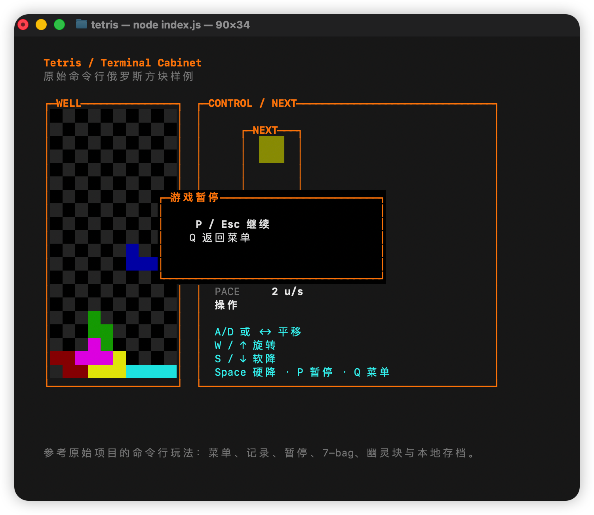

# Tetris / Terminal Cabinet

A classic Tetris implementation for the terminal, built with the tico engine.

## Screenshot



## Game Features

### Classic Tetris Mechanics
- **7-Bag Randomization** - Ensures all 7 tetrominoes appear before any repeats
- **Ghost Piece** - Shows where your piece will land
- **Hard Drop** - Instantly drop pieces with Space key
- **Soft Drop** - Faster falling with Down key
- **Hold & Preview** - See your next piece

### 7 Tetrominoes

| Piece | Color | Description |
|-------|-------|-------------|
| I | Cyan | The long bar, great for clearing 4 lines |
| O | Yellow | The square, stable and predictable |
| T | Magenta | Versatile T-shape for T-spins |
| S | Green | S-shape, mirrors Z |
| Z | Red | Z-shape, classic counterpart to S |
| J | Blue | J-shape, left-handed L |
| L | Yellow | L-shape, right-handed J |

### Scoring System

| Lines Cleared | Points (× Level) |
|---------------|------------------|
| 1 Line        | 100              |
| 2 Lines       | 300              |
| 3 Lines       | 500              |
| 4 Lines       | 800 (Tetris!)    |

Level increases every 10 lines cleared, speeding up the drop rate.

### Controls

| Key | Action |
|-----|--------|
| ← → or A/D | Move left/right |
| ↑ or W | Rotate piece |
| ↓ or S | Soft drop (faster) |
| Space | Hard drop (instant) |
| P / Esc | Pause game |
| Q / Esc | Return to menu |

### Game Modes

- **Start Game** - Begin a new game with 7-bag randomization
- **Records** - View your top 10 high scores (saved locally)
- **Exit** - Quit the game

### Features

- **Local Save** - Records are stored in `records.json`
- **Chinese UI Support** - Full Chinese interface
- **Pause/Resume** - Take breaks anytime
- **Score Tracking** - Score, lines, level, and pace displayed in real-time
- **EngineTime Demo** - Menu hints blink with `app.time.every()` and the READY toast uses `app.time.after()`

## How to Run

```bash
npm run example:tetris
```

Or directly:

```bash
node src/index.js
```

## Tech Stack

- **Engine**: [tico](https://github.com/omegod/tico) - Terminal game engine
- **Runtime**: Node.js
- **Rendering**: ASCII art with ANSI colors
- **Assets**: JSON-based tetromino definitions
- **Scheduling**: `EngineTime` scene-owned timers for UI hints

## Original Reference

This implementation is a direct port of a classic command-line Tetris, adapted to work with the tico engine while preserving all original features.

---

*Built with tico - Terminal games made simple.*
